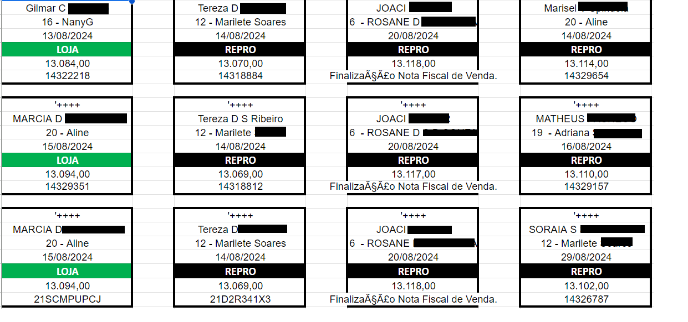

# Automate Report Exporting - Report export from ERP system and database feeding for analytics purposes

This repository has a python code to download reports from ERP used by Ótica Nany and use this data to feed a database used for customer service and analytics. Currently it's extracting customers and OS information.

The content of this abstract are:
- How to run it by yourself
- How it works
- How to report bugs and errors
- How to contribute

## How to run it by yourself

**1. Set the following environment variables in a .env file:**
    - ```STORE_PATH``` --> Local path to file saving
    - ```DB_NAME``` --> Database name
    - ```DB_USER``` --> Database username
    - ```DB_PASSWORD``` --> Database password
    - ```DB_HOST``` --> Database host
    - ```DB_PORT``` --> Database port

- Only Jit:
    - ```URL``` --> ERP url
    - ```W_USERNAME``` -->  ERP username
    - ```W_PASSWORD``` --> ERP password

- Only Customers:
    - ```FINAL_CODE``` --> Final code for customer report extraction

**2. Install requirements**
```pip install -r requirements.txt```

**3. 1 Run main file for each report type or generate .exe file for them**
- Jit
    - ```python jobs/report_export_jit.py```
    - ```pyinstaller --onefile --add-data ".env;." --windowed jobs/report_export_jit.py```
- Customer
    - ```python jobs/report_export_customer.py```
    - ```pyinstaller --onefile --add-data ".env;." --windowed jobs/report_export_customer.py```

## How it works
There are common steps for all reports:
1. Uses selenium to navigate over ERP pages to report page, set filters, download the file and save it in a specific folder.
2. Uses the data generated in the local folder to feed the database.

### Jit
For Jit, it must genrate a XLSX report from the database information in a specific folder.


### Customers
For customers the report generation and database save is enough for this service, but the tables generated from here will be used to another service to send birthday messages for customer.
[Anniversary Service](https://github.com/carvalhofg/anniversary-service)

## How to report bugs and errors

In case of bugs and problems with the execution, there can be opened a github's issue in this repository describing clarery the situation. You can find some advices to open a good issue.